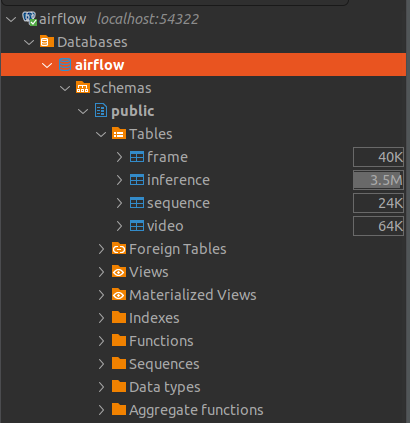
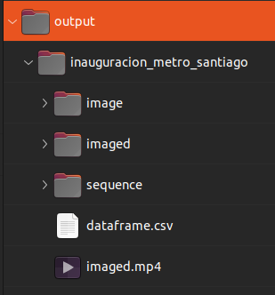
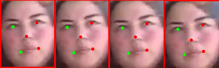

# airflow

Airflow is a pet project showing my work on **Face Recognition from video**. This repo holds the code, installation and instructions. The idea behind this project is explained [in this article](https://toopazo.github.io/face-recognition-challenge/) (in Spanish) of [my website](https://toopazo.github.io).

## What am I trying to do?

There are many similar projects, some of them are paid other are not. Here are some results after searching for "face recognition from video". 
- https://www.youtube.com/watch?v=FavHtxgP4l4
- https://www.corsight.ai/
- https://www.sentiveillance.com/face-algorithm/
- https://cloud.google.com/video-intelligence/docs/feature-face-detection
- https://github.com/prashant-cn/face-recognition-from-webcam-and-video-sources
- https://github.com/anubhavshrimal/Face-Recognition

Using AI for face recognition is a very old idea. Now a days there are many implementations, and even companies that recognize faces with reasonable accuracy. They achieve 99% accuracy or more in datasets such as [LFW or CFP-FP](https://paperswithcode.com/sota/face-recognition-on-cfp-fp). The work very well in controlled environments but tend to do poorly when put under non-ideal conditions (low resolution, face occlusion, aging, poor illumination, and a long list of other problems). This has limited the usage of this technology. 

The idea of this repo is to make use of ```face sequences``` to strengthen recognition. The comparison between faces occurs at the sequence level and not just comparing two images. Comparing cloud-of-points in a 512-vector space requires a little bit more than just the 2-norm or cosine distance between two points.

This idea is not entirely new (see [this article](https://toopazo.github.io/face-recognition-challenge/) for details). But there are few implementation around. In addition to the sequence-based approach, this implementations also tries to make face recognition at scale. The use of a Postgres extension like [pgvector](https://github.com/pgvector/pgvector) is key to make vector comparison directly on the database. See more details [here](https://www.timescale.com/learn/postgresql-extensions-pgvector). Here I will try to implement things like [Manifold–Manifold Distance](https://ieeexplore.ieee.org/document/6226465) or [Hausdorff distance](https://en.wikipedia.org/wiki/Hausdorff_distance)

## Getting started

## Cloning the repo

```bash
git clone https://github.com/toopazo/airflow.git
```

Move into airflow directory and create the virtual environment for Python
```bash
cd airflow
. ./create_venv.sh
```

This will install all the Python dependencies. If not already activated, manually active the environment using ```bash```.
```bash
source venv/bin/activate
```

## Setting up the database

Next, create the ```.env``` file to startup the database. I followed this excellent tutorial on [how to use the official Postgres' Docker image](https://www.docker.com/blog/how-to-use-the-postgres-docker-official-image/) to understand the basic variables.

The ```.env``` file should have the following variables
```bash
POSTGRES_USER=your-db-user
POSTGRES_PASSWORD=your-db-pass
POSTGRES_DB=airflow
COMPOSE_EXPOSED_PORT=54322
```

This next step is optional but recommended. Use your favorite app to connect to the database. In my case I used [DBeaver](https://dbeaver.io/). Use the credentials in ```.env``` file to connect using the ```localhost``` as host.

Next, create the tables.
```bash
python -m airflow.database.db_create
```
This only needs to be run once. The resulting view in DBeaver (or your preferred app) should be something like this.




## Process the first video

Now it is time to actually populate the database with some videos!

Let us process the videos in ```videos/```. To do this, just execute

```bash
python -m airflow.face_detector.process_video \
  videos output
```

Next, insert the result of a particular video (e.g ```inauguracion_metro_santiago.mp4```) to the database using
```bash
python -m airflow.database.insert_video \
  "videos/inauguracion_metro_santiago.mp4" \
  "output/inauguracion_metro_santiago"
```

## Find the face sequences in the processed video

Next, we can move to something interesting. Let us detect the first sequences of detected faces. We can do this running
```bash
python -m airflow.face_sequencer.find_sequences 1 output
```
The argument ```1``` above refers to the ```video_id``` with value ```1``` in the database (e.g ```1``` -> ```inauguracion_metro_santiago.mp4```). 

Now, the output directory should look like this.



The ```sequence``` directory holds the sequence of recognized faces at each frame. The example below shows frame ```49``` and the face belonging to sequence ```2```.




## Docker compose
### Using ZDG (work in progress)

Imagen base toopazo/zdg

Esta imagen es creada a partir de la excelente libreria ZMQ para intercomunicar los contenedores siguiendo un grafo dirigido.

Build the image using
```bash
  docker build -t toopazo/zdg -f Dockerfile .
```

Build the image using
```bash
docker build -t toopazo/zdg -f Dockerfile .
```
Run the image using
 ```bash 
docker run -it zdg
docker run -it zdg bash
```

Remove image using
```bash
  docker rmi -f 42af9b40137d
```

Remove all stopped containers
```bash
docker rm $(docker ps --filter status=exited -q)
```

Remove dangling images (those called <none>)
```bash
docker rmi -f $(docker images -f "dangling=true" -q)
```

Stop and remove all containers
```bash
docker ps -aq | xargs docker stop | xargs docker rm
```

Export this image to file
```bash
docker save zdg > docker_image.tar 
```

Load this image to docker
```bash
docker load --input docker_image.tar
```
