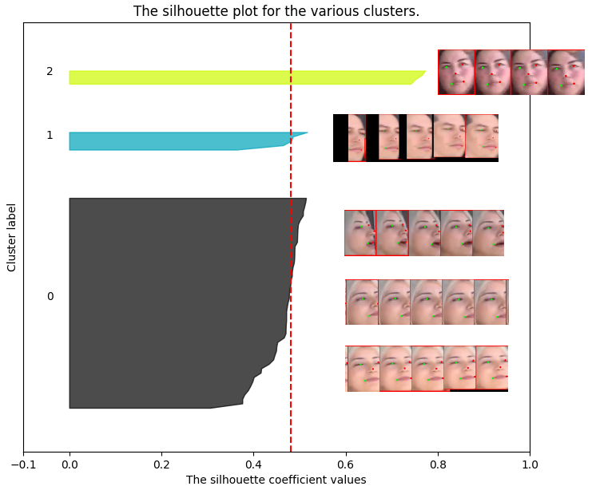
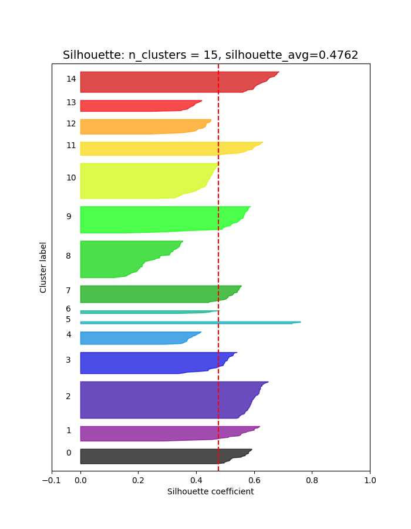
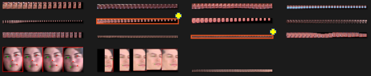
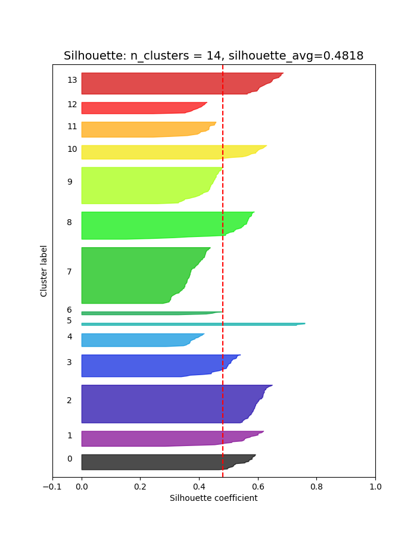
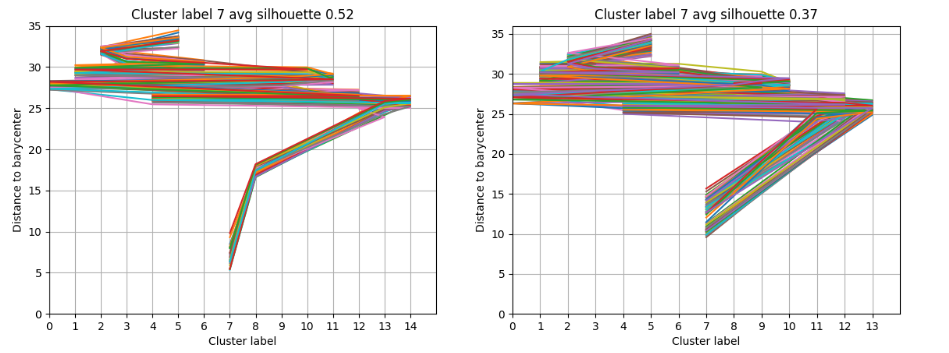

# airflow

Airflow is a pet project showing my work on **Face Recognition from video**. This repo holds the code, installation and instructions. The idea behind this project is explained [in this article](https://toopazo.github.io/face-recognition-challenge/) (in Spanish). In [my website](https://toopazo.github.io) I have similar articles about technology, control of dynamical systems, math, AI, and philosophy.

## What am I trying to do?

There are many similar projects, some of them are paid others are not. Here are some results after searching for "face recognition from video". 
- https://www.youtube.com/watch?v=FavHtxgP4l4
- https://www.corsight.ai/
- https://www.sentiveillance.com/face-algorithm/
- https://cloud.google.com/video-intelligence/docs/feature-face-detection
- https://github.com/prashant-cn/face-recognition-from-webcam-and-video-sources
- https://github.com/anubhavshrimal/Face-Recognition

Using AI for face recognition is a very old idea. Now a days there are many implementations, and even companies that recognize faces with reasonable accuracy. They achieve 99% accuracy or more in datasets such as [LFW or CFP-FP](https://paperswithcode.com/sota/face-recognition-on-cfp-fp). The work very well in controlled environments but tend to do poorly when put under non-ideal conditions (low resolution, face occlusion, aging, poor illumination, and a long list of other problems). This has limited the usage of this technology. 

The idea of this repo is to make use of ```face sequences``` to strengthen recognition. The comparison between faces occurs at the sequence level and not just comparing two images. Comparing point cloud in a 512-vector space requires a little bit more than just the 2-norm or cosine distance between two points.

This idea is not entirely new (see [this article](https://toopazo.github.io/face-recognition-challenge/) for details). But there are few implementation around. In addition to the sequence-based approach, this implementations also tries to make face recognition at scale. The use of a Postgres extension like [pgvector](https://github.com/pgvector/pgvector) is key to make vector comparison directly on the database. See more details [here](https://www.timescale.com/learn/postgresql-extensions-pgvector). Here I will try to implement things like [Manifold–Manifold Distance](https://ieeexplore.ieee.org/document/6226465) or [Hausdorff distance](https://en.wikipedia.org/wiki/Hausdorff_distance)

## Getting started

### Cloning the repo

```bash
git clone https://github.com/toopazo/airflow.git
```

Move into airflow directory and create the virtual environment for Python
```bash
cd airflow
. ./create_venv.sh
```

This will install all the Python dependencies. If not already activated, manually active the environment using ```bash```.
```bash
source venv/bin/activate
```

### Setting up the database

Next, create the ```.env``` file to startup the database. I followed this excellent tutorial on [how to use the official Postgres' Docker image](https://www.docker.com/blog/how-to-use-the-postgres-docker-official-image/) to understand the basic variables.

The ```.env``` file should have the following variables
```bash
POSTGRES_USER=your-db-user
POSTGRES_PASSWORD=your-db-pass
POSTGRES_DB=airflow
COMPOSE_EXPOSED_PORT=54322
```

This next step is optional but recommended. Use your favorite app to connect to the database. In my case I used [DBeaver](https://dbeaver.io/). Use the credentials in ```.env``` file to connect using the ```localhost``` as host.

Next, create the tables.
```bash
python -m airflow.database.db_create
```
This only needs to be run once. The resulting view in DBeaver (or your preferred app) should be something like this.


### Process the first video

Now it is time to actually populate the database with some videos!

Let us process the videos in ```videos/```. To do this, just execute

```bash
python -m airflow.face_detector.process_video \
      videos/inauguracion_metro_santiago.mp4 \
      output
```

Next, insert the result of a particular video (e.g ```inauguracion_metro_santiago.mp4```) to the database using
```bash
python -m airflow.database.insert_video \
  videos/inauguracion_metro_santiago.mp4 \
  output/inauguracion_metro_santiago
```

### Find face sequences in video

Next, we can move to something interesting. Let us detect the first sequences of detected faces. We can do this running
```bash
python -m airflow.face_sequencer.find_sequences 1 output
```
The argument ```1``` above refers to the ```video_id``` with value ```1``` in the database (e.g ```1``` -> ```inauguracion_metro_santiago.mp4```). 

Now, the output directory should look like this.


The ```sequence``` directory holds the sequence of recognized faces at each frame. The example below shows frame ```49``` and the face belonging to sequence ```2```.


### Filter found sequences

From a mathematical point of view, every face was projected into a high dimensional point. We need to make sure that the quality of the stored vectors allows to recognize the person once we see him/her again. 

In order to do this we run
```bash
python -m  airflow.face_reider.sequence_cluster_eval \ 
"output/inauguracion_metro_santiago"
```

After running this command a few images should appear in the output directory. 

File ```sequence_cluster_eval.py``` assumes that the sequences we are looking for, come from frame ```49```. These are:
```Python
useqs = [
        "frame_id_000049_active_seq_000000",
        "frame_id_000049_active_seq_000001",
        "frame_id_000049_active_seq_000002",
    ]
```
The insertion of this particular frame into the database was hardcoded in file ```find_sequences.py``` and can be changed as needed.

But regardless of were we got the sequences from. The quality of the sequence depends on how close together are the vectors in the sequence, and how apart are the vectors from other vectors belonging to all the other sequences. 

The assumptions is that if we ever get to see similar vectors in the future. Then, that very likely means that the same person showed up again. 

Face recognition is a ***classification problem***. However, here we borrow a tool from a ***clustering problem*** called [Silhouette](https://en.wikipedia.org/wiki/Silhouette_(clustering)). This measurement is analogous to the [Pearson correlation coefficient](https://en.wikipedia.org/wiki/Pearson_correlation_coefficient) in the sense that a value of +1 indicates a perfect concentration of vectors around a single point and a non-zero distance to the nearest sequence (to its vectors). A value of 0 means that the average distance between the sequence and the nearest neighboring sequence is the same (equal). This is bad because we can not differentiate to what sequence it belongs. Finally a value of -1 means that the vector was classified in the wrong sequence, as it is closer to another sequence. A clustering with an average silhouette width of over 0.7 is considered to be strong, a value over 0.5 reasonable and a value over 0.25 is considered weak.

For the specified sequences the result is seen in the image below. 



As we can see the clustering is almost reasonable. If this were not the case, then we would need to modify the steps before in order to ***enforce*** a proper cluster separation.

### Recognize (merge) face sequences

As it was said before, recognizing a known face among an existing database of faces is re-interpreted as comparing clusters of vectors. Two types of clusters are importante: ***face sequences clusters*** and ***face clusters***. Each ***face cluster*** is made up of one or more ***face sequences cluster*** that belong to the same person. On the other hand, each ***face sequence clusters*** is the result of a single sequence (as the name suggests). The merging of a face sequence cluster into a face cluster is interpreted as recognizing a person. 

Thus, instead of comparing an unknown face (one vector) with a known face (also one vector), the comparison is between an unknown face sequence (a sequence of vectors) and a known face cluster (also a sequence of vectors).

In the approach of this work, the problem is NOT a clustering problem. and therefore algorithms like Hierarchical clustering, model-based clustering, K-means, DBSCAN, OPTICS, CLIQUE, and others are not relevant. What we are trying to do is to ***build and maintain*** a well separated cluster. 

By design, every new face sequence will be either added as a new well separated cluster or incorporated into an existing cluster. The ultimate assumption is that a database of well defined clusters enables a better face recognition than image by image methods. 

The idea of a well behaved cluster, or a well separated cluster is vague and needs to be better defined. The [wiki page on cluster analysis](https://en.wikipedia.org/wiki/Cluster_analysis#Internal_evaluation) mentions three established methods of internal evaluation:
- Davies–Bouldin index
- Dunn index
- Silhouette coefficient

The [Silhouette coefficient](https://en.wikipedia.org/wiki/Silhouette_(clustering)) is used in this work to maintain the database of face clusters with values higher than a predefined threshold $s_{min}$. The Silhouette coefficient is often considered somewhat analogous to the [Pearson coefficient of correlation](https://en.wikipedia.org/wiki/Pearson_correlation_coefficient). Both provide a value between -1 and +1. A value closer to +1 indicates strong correlation (strong cluster cohesion). A cluster with an average Silhouette value below 0.25 can not be considered cohesive. This lower limit provides an objective value to evaluate cluster cohesion and is the main advantage of the Silhouette coefficient a metric for internal evaluation. 

In the code, the task of face recognition is called ReId (Re Identify) and is executed using:

```bash
python -m  airflow.face_reider.sequence_cluster_reid output
```

At first, all face sequences are assumed to be distinct face clusters. The resulting internal evaluation is shown below.

There are 15 face sequence taken from the original video,

The face sequences can be seen in the image below. 

The two face sequences marked with a yellow cross belong to the same person. Our algorithm recognises this in two steps. 

First. Looking at the Silhouette plot, it can be seen that 4 clusters show good cohesion (silhouette values above 0.55). And others show a bad cohesion, in particular cluster 8 has an average Silhouette coefficient of just 0.26. If one were to take every vector in sequence 8 and check for the distances to every other cluster the result would be the image below. 


Here, every line represents a particular vector in sequence 8. The closest barycenter (the center point of every cluster) is that of cluster 8 (as it should be, nothing strange here). The second closest barycenter is that of cluster 7. The third closest barycenter is that of cluster 13 and 14 depending on the particular vector in sequence 8 we are tracking. Using this information we can test wether is a good idea, or not, to merge cluster 8 into cluster 7 and re-evaluate the whole database. This is the seconds step. 

Second. The vectors in the face sequence 7 and 8 are merged, and the rest of the face clusters are re-indexed. Thus, the cluster 9 now became cluster 8 and cluster 10 became cluster 9, and so on. The Silhouette coefficient are re-calculated and the result is shown below.


The total number of clusters is now 14 instead of 15. Most importantly, no cluster has an average Silhouette coefficient below 0.25. The recognition of face is clear by looking at the sequences.


Finally, it is important to notice the although the recognition was successful, the cluster 7 became less cohesive than before. This is clear when comparing Silhouette before and after.


The value before was 0.52 and after it is 0.37. This last value is still above the threshold of 0.25 but significantly less than the original 0.52. 

A smart algorithm should have some sort of loss of memory in order to drop vectors that diminish cluster cohesion as new sequences are merged (recognized). This is not yet implemented, but is being considered for development. 

&nbsp;

&nbsp;

&nbsp;

&nbsp;


## Docker compose
### Using ZDG (work in progress)

Imagen base toopazo/zdg

Esta imagen es creada a partir de la excelente libreria ZMQ para intercomunicar los contenedores siguiendo un grafo dirigido.

Build the image using
```bash
  docker build -t toopazo/zdg -f Dockerfile .
```

Build the image using
```bash
docker build -t toopazo/zdg -f Dockerfile .
```
Run the image using
 ```bash 
docker run -it zdg
docker run -it zdg bash
```

Remove image using
```bash
  docker rmi -f 42af9b40137d
```

Remove all stopped containers
```bash
docker rm $(docker ps --filter status=exited -q)
```

Remove dangling images (those called <none>)
```bash
docker rmi -f $(docker images -f "dangling=true" -q)
```

Stop and remove all containers
```bash
docker ps -aq | xargs docker stop | xargs docker rm
```

Export this image to file
```bash
docker save zdg > docker_image.tar 
```

Load this image to docker
```bash
docker load --input docker_image.tar
```
